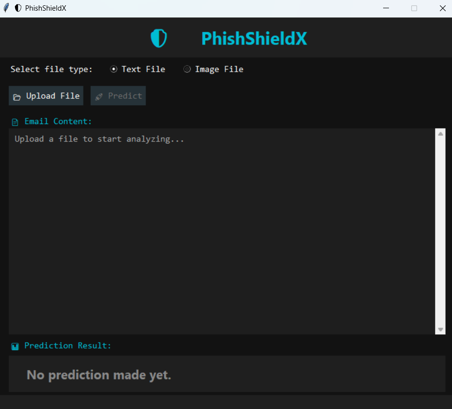

# 📧 Mail Threat Detection

**Mail Threat Detection** is a smart email scanner built with **machine learning** and **OCR (Optical Character Recognition)**. It helps detect **phishing** and **spam emails** before they become a threat.

Users can **either type/paste the email content** or **upload an image** (like a screenshot of an email). The app will extract the text from the image, scan it using a trained model, and instantly show whether the message is **safe** or **spam**.

It’s a helpful tool for students, office workers, and anyone who wants to stay safe from online email threats.

---

## 🔍 Key Features

- ✅ Scans email text and predicts: `Spam` or `Safe`
- 🖼️ Supports image input — Extracts email content using OCR (Tesseract)
- 🧠 Uses trained ML model (Naive Bayes) and TfidfVectorizer
- 🖥️ Simple and clean GUI (Tkinter)
- 💡 Very easy to run – No advanced setup required
- 🔐 Works offline after installation
## 🖼️ Demo



---

## 📁 Folder Structure

```
email-threat-detector/
├── README.md                   # Overview, instructions, and usage guide
├── requirements.txt           # Required Python libraries
│
├── training/                  # Training-related files
│   ├── train_model.py         # All training logic (from spam_classifier.py)
│   └── dataset/               # Email dataset folders
│       ├── spam/
│       ├── spam_2/
│       ├── easy_ham/
│       ├── easy_ham_2/
│       └── hard_ham/
│
├── saved_models/              # Trained model and vectorizer
│   ├── spam_classifier_model.pkl
│   └── vectorizer.pkl
│
├── gui/                       # GUI to run predictions
│   └── phishing_email_gui.py  # GUI app using trained model
│   
│
└── utils/                     # (Optional) Helper functions in the future
    └── email_cleaner.py       # You can move clean_email() here if modularizin
```

---

## ⚙️ Requirements

Install the required libraries with:

```bash
pip install -r requirements.txt
```

Example `requirements.txt`:

```
pillow
pytesseract
scikit-learn
numpy
tk
```

---

## 🚀 How to Run

✅ 1. Clone the repository:

```bash
git clone https://github.com/Tinsaie/PhishShield.git
cd PhishShield
```

✅ 2. Install dependencies:

```bash
pip install -r requirements.txt
```
✅ 3. Install Tesseract OCR Engine
This is used to read text from images.

Download from:
https://github.com/tesseract-ocr/tesseract

Install it

Add the path to Tesseract in your system environment (e.g. C:\Program Files\Tesseract-OCR)

Restart your computer if needed

---

✅ 4. Run the application:

```bash
python phishing_app.py.py
```

---

## 🧪 Model Info

- **Algorithm:** Multinomial Naive Bayes
- **Input:** URL (string)
- **Output:** "PHISHING EMAIL" or "NORMAL EMAIL"

How the Model Was Trained

- Data Collection: Gathered a dataset of emails labeled as spam/phishing or safe (normal).

- Data Preprocessing: Cleaned emails by removing special characters and lowercasing all text.

- Feature Extraction: Converted text into numeric features using TfidfVectorizer to capture important words.

- Model Training: Used Multinomial Naive Bayes from scikit-learn, splitting data into 80% training and 20% testing.

- Evaluation: Tested model accuracy on the test data and tuned preprocessing/parameters accordingly.

- Saving: Saved the trained model and vectorizer using pickle for use in the app.

---

## ✍️ Author

- **Tinsaie**
- Email: tinsaiebbs@gmail.com
- GitHub: [@Tinsaie](https://github.com/Tinsaie)

---

